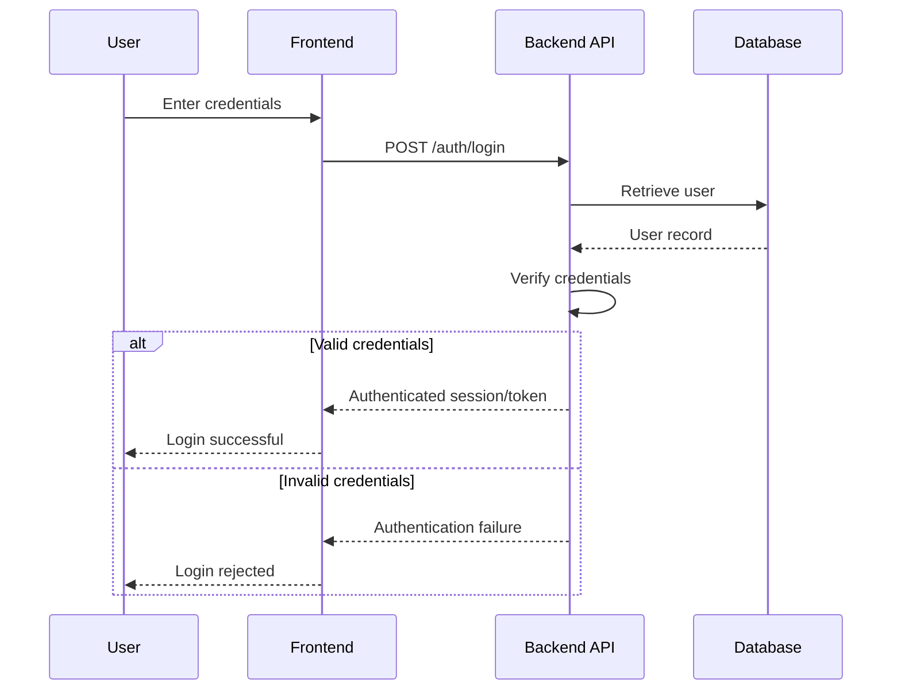

# Authentication & Authorization Flow

## Authentication

Authentication answers:

> Who is the user?

A user submits credentials to the authentication endpoint.



---

# Authorization

Authorization answers:

> What is the authenticated user allowed to do?

Authentication alone does not provide unrestricted application access.

Example:

```text
Authenticated Employee
        |
        v
GET /payroll/employee-200
        |
        v
Backend checks identity
        |
        v
Backend checks role + resource ownership
        |
        v
ALLOW or DENY
```

Authorization decisions are made by the backend and must not rely solely on frontend restrictions.

---

## Security Requirements

The authentication system should eventually support:

- Secure credential storage
- MFA for privileged accounts
- Session expiration
- Secure logout
- Failed-login monitoring
- Rate limiting
- Role-based access control
- Audit logging
