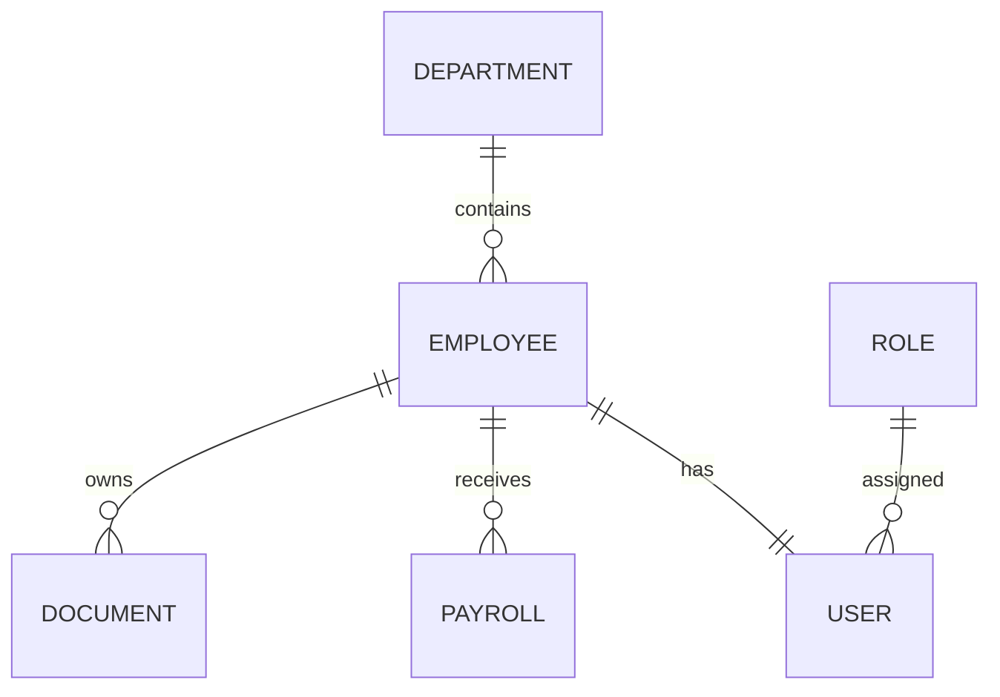

# Database Design

## Objective

The relational database stores structured business data used by the Employee Management System.

---

## Core Entities

### Users

Represents application identities.

Example fields:

- user_id
- email
- password_hash
- role_id
- employee_id
- account_status
- created_at

---

### Employees

Represents employee information.

Example fields:

- employee_id
- first_name
- last_name
- department_id
- job_title
- employment_status
- hire_date

---

### Roles

Defines application authorization roles.

Example fields:

- role_id
- role_name

Example roles:

- CEO
- HR
- Finance
- Developer
- Security
- Employee

---

### Departments

Represents organizational departments.

Example fields:

- department_id
- department_name

---

### Payroll

Contains employee payroll information.

Example fields:

- payroll_id
- employee_id
- salary
- payment_period
- payment_status
- updated_at

---

### Documents

Stores metadata describing employee documents.

The actual files are kept in document storage.

Example fields:

- document_id
- employee_id
- document_type
- storage_reference
- uploaded_at
- uploaded_by
-classification
-content_type
-checksum

---

## Entity Relationships

---

## Security Considerations

Sensitive database information must be protected through:

- Strong authentication
- Authorization
- Encryption
- Restricted database access
- Parameterized database queries
- Backup and recovery
- Audit logging

Application users must never connect directly to the database.
