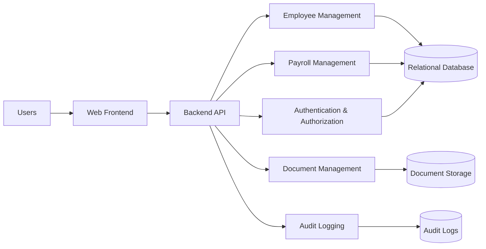

# Phase 1:Application Architecture

## Objective

Phase 1 defines the software architecture of the Employee Management System before selecting any cloud infrastructure.

The goal is to understand how users, application components, data stores, and security controls interact.

AWS services will be selected in a later phase.

---

## High-Level Architecture

The Employee Management System follows a web application architecture consisting of:

- Web Frontend
- Backend API
- Authentication and Authorization
- Employee Management
- Payroll Management
- Document Management
- Audit Logging
- Relational Database
- Document Storage

---

## Architectural Approach

The first version will use a modular application architecture rather than independent microservices.

Business functionality is separated logically into modules while keeping the initial system simple enough to build, secure, monitor, and understand.

The architecture can later evolve if scalability or operational requirements justify separating components.

---

## Security Principles

The application will be designed around:

- Authentication for protected functionality
- Role-based authorization
- Least privilege
- Encryption of sensitive information
- Input validation
- Secure secret handling
- Audit logging
- Separation of duties
- Secure document access
- Monitoring of privileged operations

---

## Phase 1 Outcome

At the end of this phase the project will have documented:

1. Application architecture
2. Application components
3. Database model
4. API design
5. Authentication and authorization flow
6. Important application sequence flows

The completed architecture will become the input for the threat-modeling phase.
