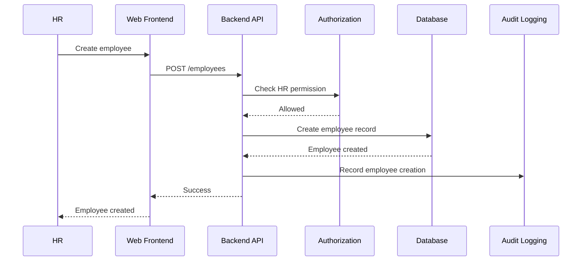
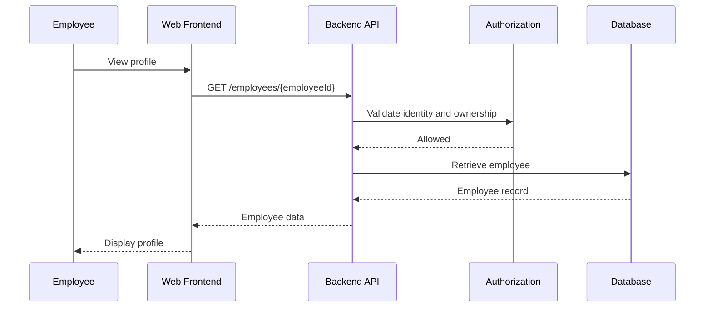
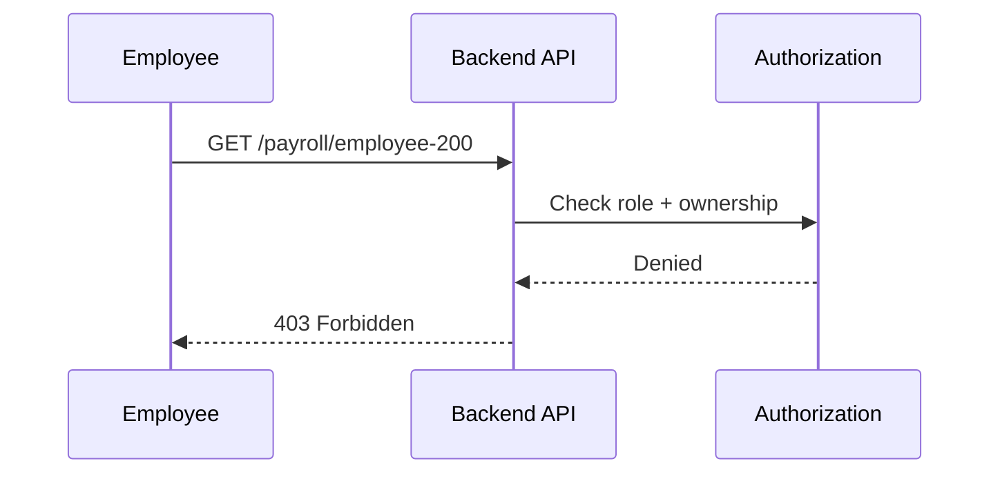
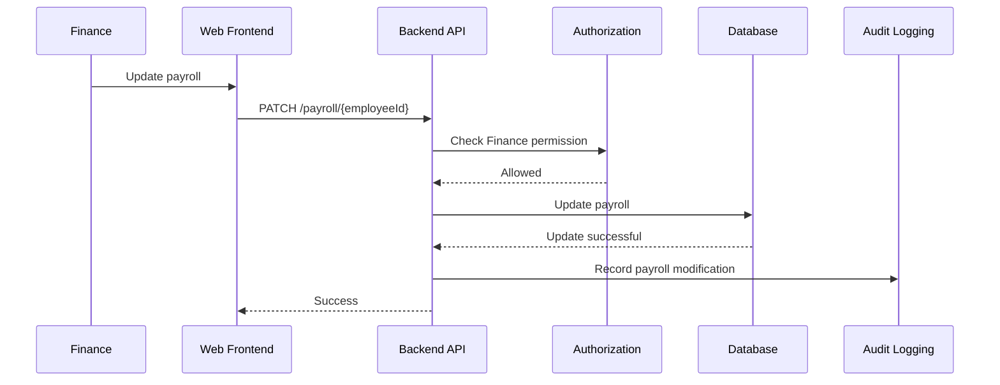
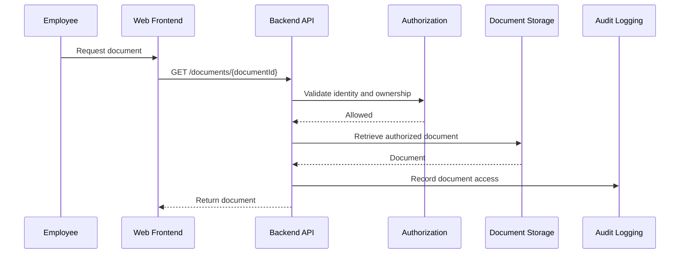

# Application Sequence Diagrams

Sequence diagrams document how application components interact during important business operations.

---

# HR Creates Employee

---

# Employee Views Own Profile

---

# Finance Updates Payroll

---

# Employee Downloads Document

