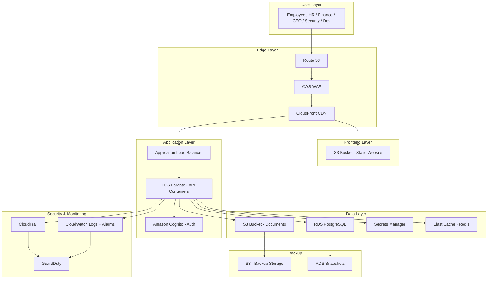

## You're right — let's clean this up and make it professional.

Here's **exactly** what to put in `Phase3/aws-architecture.md` — clean, focused, and professional.

---

```markdown
# Phase 3: AWS Architecture

## Overview

The Employee Management System is deployed on AWS using a combination of managed and serverless services. The architecture follows security best practices: least privilege IAM, encryption at rest and in transit, network isolation, and comprehensive logging.

---

## Architecture Diagram



---

## Service Inventory

| Layer | Service | Purpose |
|-------|---------|---------|
| **Edge** | Route 53 | DNS resolution |
| **Edge** | AWS WAF | Rate limiting, SQLi/XSS protection |
| **Edge** | CloudFront | CDN + HTTPS termination |
| **Frontend** | S3 | Static website hosting |
| **Application** | ALB | Distribute traffic to API containers |
| **Application** | ECS Fargate | Run containerized API |
| **Application** | Cognito | Authentication + MFA |
| **Data** | RDS (PostgreSQL) | Relational data (employees, payroll) |
| **Data** | S3 | Document storage |
| **Data** | Secrets Manager | Credentials and secrets |
| **Data** | ElastiCache | Session storage |
| **Monitoring** | CloudTrail | API audit logging |
| **Monitoring** | CloudWatch | Logs + metrics + alerts |
| **Monitoring** | GuardDuty | Threat detection |
| **Backup** | S3 | Document backup |
| **Backup** | RDS Snapshots | Database backups |

---

## Network Design

| Component | CIDR |
|-----------|------|
| VPC | 10.0.0.0/16 |
| Public Subnet A | 10.0.1.0/24 |
| Public Subnet B | 10.0.2.0/24 |
| Private Subnet A | 10.0.10.0/24 |
| Private Subnet B | 10.0.11.0/24 |
| Database Subnet | 10.0.20.0/24 |

**Key Points:**
- Load balancer sits in public subnets
- API containers run in private subnets (no internet access)
- Database runs in isolated database subnets
- All outbound internet goes through NAT Gateway

---

## Security Controls

| Control | Implementation | AWS Service |
|---------|----------------|-------------|
| Encryption at rest | AWS KMS | RDS + S3 |
| Encryption in transit | TLS | HTTPS everywhere |
| Authentication | JWT + MFA | Cognito |
| Authorization | IAM roles + Cognito groups | IAM |
| Rate limiting | WAF rules | AWS WAF |
| SQL injection protection | WAF + parameterized queries | WAF |
| XSS protection | WAF + CSP headers | WAF |
| Secrets rotation | Automatic rotation | Secrets Manager |
| Audit logging | All API calls logged | CloudTrail |
| Threat detection | Automated analysis | GuardDuty |
| Backup | Daily automated | RDS + S3 |
| DDoS protection | Always-on | Shield Standard |
| Vulnerability scanning | Container/EC2 scanning | Inspector |
| Network isolation | Private subnets | VPC |

---

## IAM Roles

### API Execution Role (ECS Task)

| Permission | Purpose |
|------------|---------|
| `s3:GetObject` | Retrieve employee documents |
| `s3:PutObject` | Upload employee documents |
| `rds-db:connect` | Connect to PostgreSQL |
| `secretsmanager:GetSecretValue` | Read database credentials |
| `cloudwatch:PutMetricData` | Send application metrics |
| `logs:CreateLogStream` | Create log streams |
| `logs:PutLogEvents` | Write application logs |

### Developer Deployment Role

| Permission | Purpose |
|------------|---------|
| `ecs:UpdateService` | Deploy new API versions |
| `ecs:DescribeServices` | Check deployment status |
| `s3:PutObject` | Upload frontend assets |
| `cloudfront:CreateInvalidation` | Clear CDN cache after deployment |

### Security Audit Role

| Permission | Purpose |
|------------|---------|
| `cloudtrail:LookupEvents` | Review audit logs |
| `cloudwatch:GetMetricData` | View CloudWatch metrics |
| `guardduty:GetFindings` | Review security findings |
| `iam:GetRole` | Inspect IAM roles |
| `iam:GetPolicy` | Review IAM policies |

---

## Data Flow

1. **User requests page** → Route 53 → WAF → CloudFront → S3 (frontend)
2. **User authenticates** → CloudFront → ALB → ECS → Cognito
3. **API request** → CloudFront → ALB → ECS → RDS / S3 / Secrets
4. **Document upload** → ECS → S3 (documents bucket)
5. **All actions logged** → ECS → CloudTrail → CloudWatch → GuardDuty

---

## Why These Services?

| Decision | Rationale |
|----------|-----------|
| S3 + CloudFront over EC2 | Cheaper, faster CDN, no server management |
| ECS Fargate over EC2 | No servers to patch, auto-scaling built-in |
| RDS over self-managed | Automated backups, failover, encryption |
| Cognito over custom JWT | MFA, user management, social login |
| S3 for documents | Scalable, lifecycle policies, versioning |
| Secrets Manager over .env | Automatic rotation, audit logs, IAM integration |
| CloudTrail over custom logs | Immutable, all API calls tracked |
| GuardDuty over manual review | Automated threat detection |
```

