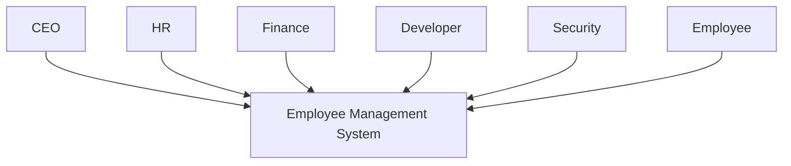
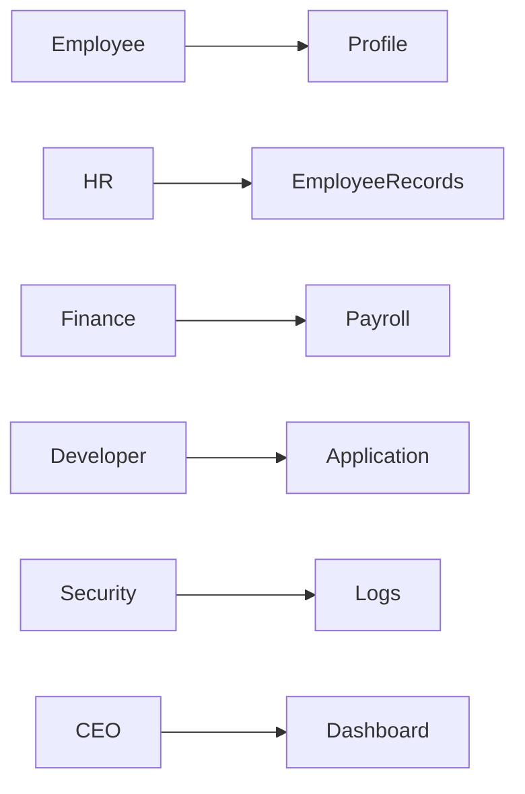

# Roles & Permissions

Before choosing AWS services, we first define who will use the system.

Every user has different responsibilities, which later translate into AWS IAM policies and application authorization.

---

## 👨‍💼 CEO

The CEO has executive-level visibility.

Responsibilities

- View company dashboard
- View reports
- View employee statistics
- View financial summaries

The CEO cannot:

- Modify payroll
- Deploy applications
- Access AWS infrastructure

---

## 👩‍💼 Human Resources (HR)

HR manages employee information.

Responsibilities

- Create employees
- Edit employee profiles
- Upload contracts
- Upload identification documents
- Disable employee accounts

HR cannot:

- View AWS resources
- Access application secrets
- Deploy code

---

## 💰 Finance

Finance manages payroll.

Responsibilities

- Process salaries
- View payroll
- Export payment reports

Finance cannot:

- Edit employee contracts
- Manage infrastructure
- Read application secrets

---

## 👨‍💻 Developer

Developers build the application.

Responsibilities

- Deploy new versions
- Debug the application
- View application logs

Developers cannot:

- View payroll
- Modify employee records
- Read production secrets

---

## 🛡️ Security Team

The security team protects the platform.

Responsibilities

- Review logs
- Investigate incidents
- Monitor suspicious activity
- Review IAM permissions

Security cannot:

- Modify payroll
- Change employee contracts

---

## 👤 Employee

Normal employees have limited access.

Responsibilities

- View their profile
- Download their own documents
- Update limited personal information

Employees cannot:

- View other employees
- View payroll data
- Access administration features

  
                                            ## System Context  ##  System Context 

                                      ## Business Responsibilities

